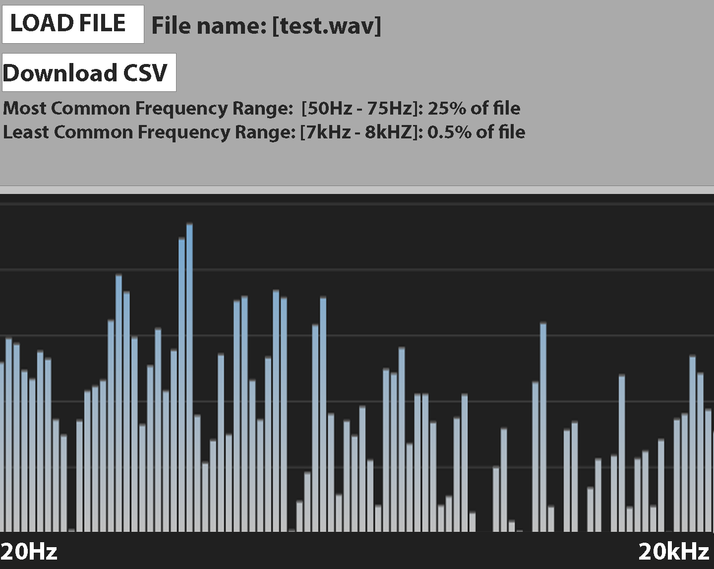

# FreqOut
#### *An AXL.audio Production*

Program intends to compute average relative frequency ranges for audio files by utilizing Fast Fourier Transform. It will feature a basic UI for file importation and frequency visualization.

**Project Collaborators**
---
- Evan Gehler
- Jack Payne
- Thomas Miller

***(Rough)* Layout Concept**
---

