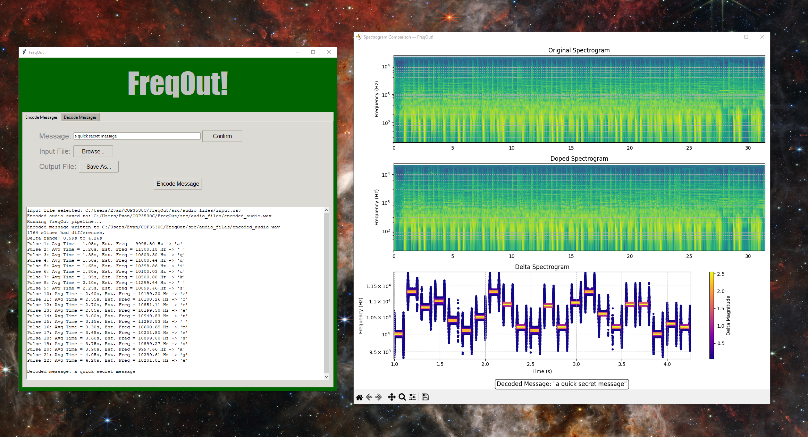

# FreqOut

Program compares two audio files via STFT analysis, then outputs difference.

Additionally, program implements encoding and decoding capabilities, allowing user to encode messages via
sinewaves. Decoding is implemented by resolving delta slice frequency.

Visualizations are created with matplotlib

**Recent Updates**
- GUI implementation with Tkinter
- Custom message encoding

**Future updates**:
- Variable FFT window resolution
- Optimization of comparison algorithm via custom hashing function

Current Working Interface 
---


**Installation**
---
Program utilizes python and pip for package management

First, clone and open repository:
```
git clone https://github.com/evangehler/FreqOut.git
cd FreqOut
```
Then install required dependencies via pip:
```
pip install -r requirements.txt
```
If this does not work on your machine, manually install with:
```
pip install numpy librosa matplotlib soundfile
```
***Note***: *Make sure you have **tkinter** installed if you are on certain Linux distributions*

Finally, navigate to source folder and run program
```
cd src
python main.py
```


**Project Collaborators**
---
- Evan Gehler
- Jack Payne
- Thomas Miller

