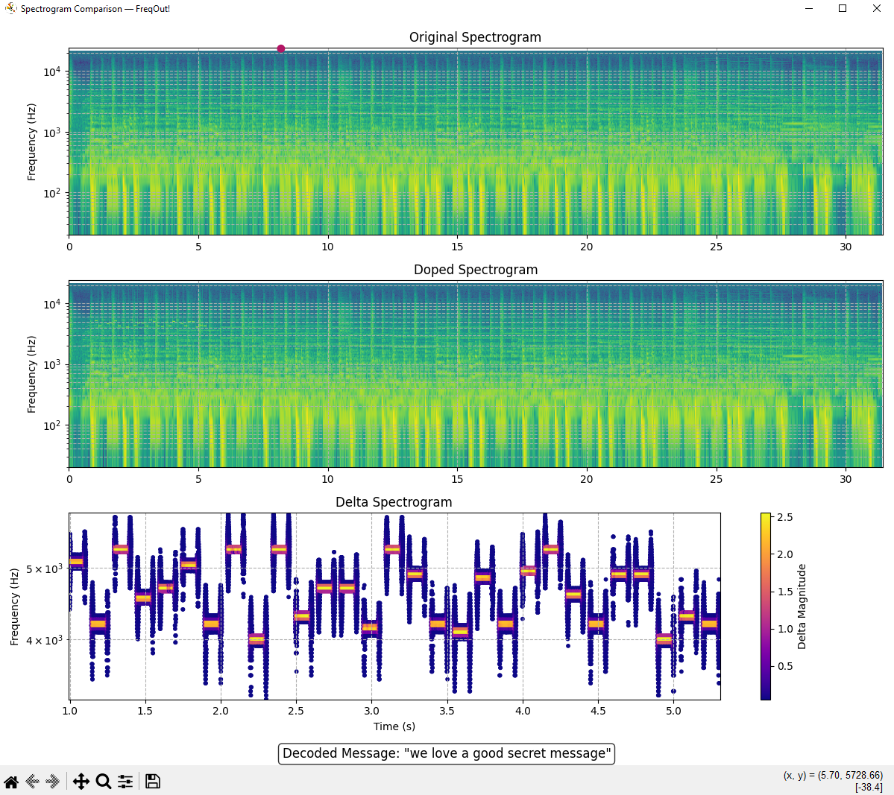
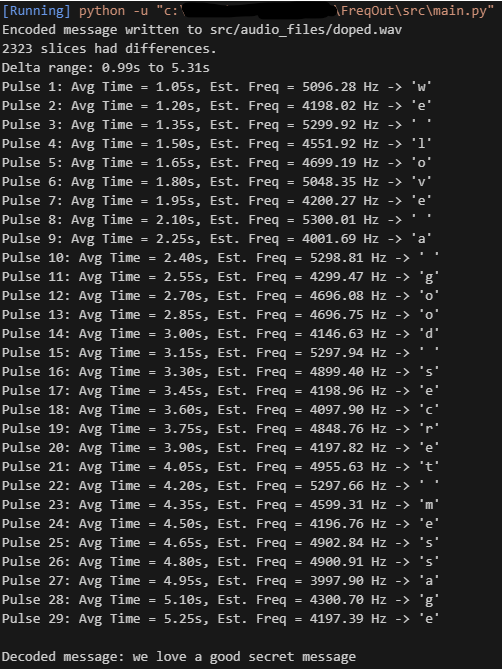

# FreqOut

Program compares two audio files via STFT analysis, then outputs difference.

Additionally, program implements encoding and decoding capabilities, allowing user to encode messages via
sinewaves. Decoding is implemented by resolving delta slice frequency.

Visualizations are created with matplotlib

Future updates include CLI or GUI to implement:
- Audio file loading / saving
- Custom message encoding and decoding w/ base frequency variation
- Variable FFT window resolution

Additionally:
- Optimization of comparison algorithm via custom hashing function

Plotted example  
---

Command Line Output
---

**Required packages**
---

- matplotlib
- numpy
- librosa
- soundfile

**Project Collaborators**
---
- Evan Gehler
- Jack Payne
- Thomas Miller

